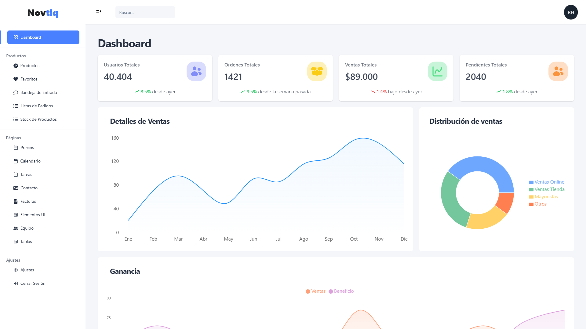

# Novtiq Template Dashboard


**Novtiq Template Dashboard** is a modern control panel template built with **React.js**, **Tailwind CSS**, **Recharts**, and **Novtiq Modal**. Designed to create interactive and customizable dashboards quickly and efficiently.



## ✨ Features

- 📊 Interactive and customizable charts
- 🎯 Modern and responsive design
- 📱 Adaptable to all devices
- 🚀 Rapid development with TypeScript
- 🎨 Customizable themes

## 🚀 Installation

1. **Install dependencies**:
   ```bash
   pnpm install
   ```

2. **Start the project**:
   ```bash
   # Development mode
   pnpm dev

   # Build for production
   pnpm build
   ```

## 📁 Main Directories

```
src/
├── components/        # Reusable UI components (buttons, cards, inputs, tables)
│
├── data/             # Static data
│
├── hooks/            # Custom React hooks for reusable logic
│
├── layouts/          # Base structure components (navbar, sidebar, containers)
│
├── modules/          # Functional modules organized by feature (auth, dashboard, settings)
│
├── router/           # Application routes and navigation configuration
│
├── schemas/          # TypeScript definitions, interfaces, types and validations
│
├── store/            # Global state management with Zustand, separated by stores
│
├── styles/           # Global styles, CSS variables, theme configuration
│
└── utils/            # Utility functions, helpers and shared logic
```

## ⚙️ Customization

### Themes
Modify `tailwind.config.js` to customize colors and styles:
```javascript
module.exports = {
  theme: {
    extend: {
      colors: {
        primary: "#4880FF",
        secondary: "#202224",
        ...
      }
    }
  }
}
```

## 🛠️ Technologies

- **React.js** - UI Library
- **TypeScript** - Static typing
- **Tailwind CSS** - Styling framework
- **Recharts** - Charts library
- **Zustand** - State management
- **React Router** - Routing
- **Novtiq Modal** - Modal system